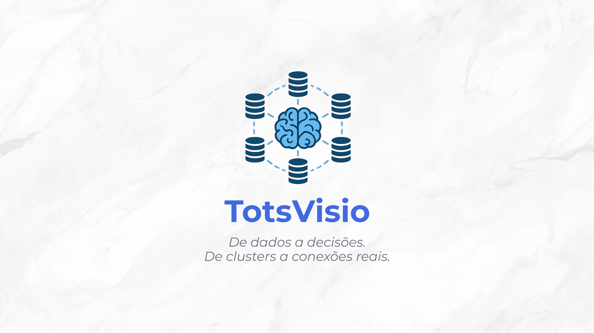

    <a href="https://azure.microsoft.com/">
        <image src="https://img.shields.io/badge/Microsoft_Azure-0089D6?style=for-the-badge&logo=microsoft-azure&logoColor=white">
    </a>
    <a href="https://jupyter.org">
        <image src="https://img.shields.io/badge/jupyter-%23FA0F00.svg?style=for-the-badge&logo=jupyter&logoColor=white">
    </a>
    <a href="https://www.python.org/">
        <image src="https://img.shields.io/badge/Python-FFD43B?style=for-the-badge&logo=python&logoColor=blue">
    </a>
    <a href="https://scikit-learn.org/stable">
        <image src="https://img.shields.io/badge/scikit--learn-%23F7931E.svg?style=for-the-badge&logo=scikit-learn&logoColor=white">
    </a>
    <a href="https://pandas.pydata.org/">
        <image src="https://img.shields.io/badge/pandas-%23150458.svg?style=for-the-badge&logo=pandas&logoColor=white">
    </a>
    <a href="https://matplotlib.org/">
        <image src="https://img.shields.io/badge/Matplotlib-%23ffffff.svg?style=for-the-badge&logo=Matplotlib&logoColor=black">
    </a>
    <a href="https://www.microsoft.com/pt-br/power-platform/products/power-bi">
        <image src="https://img.shields.io/badge/power_bi-F2C811?style=for-the-badge&logo=powerbi&logoColor=black">
    </a>

# TotsVisio - FIAP Enterprise Challenge 2025 - Grupo GPT
## Assista ao nosso Pitch aqui: [TotsVisio - Pitch Enterprise Challenge 2025 - FIAP - Grupo GPT](https://www.youtube.com/watch?v=e8K8D2V4Dvs)

<!--  -->

## Descrição do Projeto:

## Quem somos: