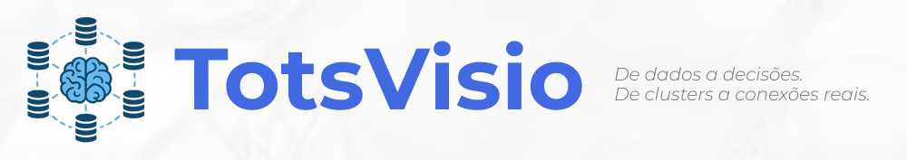

    <a href="https://www.python.org/">
        <image src="https://img.shields.io/badge/Python-FFD43B?style=for-the-badge&logo=python&logoColor=blue">
    </a>
    <a href="https://flask.palletsprojects.com/en/2.3.x/">
        <image src="https://img.shields.io/badge/flask-%23000.svg?style=for-the-badge&logo=flask&logoColor=white">
    </a>
    <a href="https://www.sqlite.org/index.html">
        <image src="https://img.shields.io/badge/sqlite-%2307405e.svg?style=for-the-badge&logo=sqlite&logoColor=white">
    </a>
    <a href="https://www.w3.org/html/">
        <image src="https://img.shields.io/badge/HTML5-E34F26?style=for-the-badge&logo=html5&logoColor=white">
    </a>
    <a href="https://matplotlib.org/">
        <image src="https://img.shields.io/badge/Matplotlib-%23ffffff.svg?style=for-the-badge&logo=Matplotlib&logoColor=black">
    </a>
    <a href="https://pandas.pydata.org/">
        <image src="https://img.shields.io/badge/pandas-%23150458.svg?style=for-the-badge&logo=pandas&logoColor=white">
    </a>

# TotsVisio - FIAP Enterprise Challenge 2025 - Grupo GPT
## Assista ao nosso Pitch aqui: 

## Descrição do Projeto:

## Quem somos: